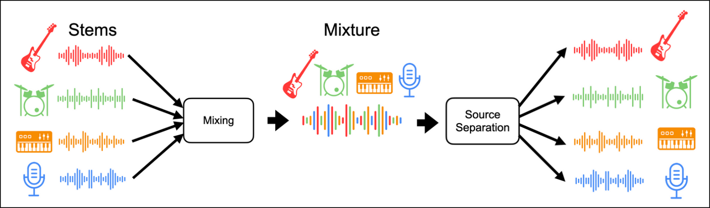

# OnAir Music Dataset

This is a dataset of music stems from the OnAir Music project for royalty-free songs:
* [TheOnAir.Music on Instagram ](https://www.instagram.com/theonair.music/)
* [OnAir Music on Spotify ](https://open.spotify.com/artist/7IYLENV1pGGPvL6wkyl7t5)

The OnAir Music project is created and maintained by:
* Hrag: [@nazguitar on Instagram ](https://www.instagram.com/nazguitar/), [NAZ on YouTube ](https://www.youtube.com/channel/UCOJWAbfcCw2gkkkRZv1es_A)
* The Crescent MTL Project: [@thecrescentmtl on Instagram](https://www.instagram.com/thecrescentmtl/), [The Crescent on YouTube ](https://www.youtube.com/c/TheCrescent)

The dataset on GitHub is maintained by Sevag: [sevagh on GitHub ](https://github.com/sevagh)

The intent of releasing this stems dataset is for free and open Music Demixing research. The stems dataset is licensed under the Creative Commons Attribution Share Alike 4.0 International.

## Music demixing

Read more about Music Demixing on the ISMIR 2021 Music Demixing Challenge [competition page](https://www.aicrowd.com/challenges/music-demixing-challenge-ismir-2021). The task of music demixing or source separation is to separate a mixed song into isolated stems. This can have uses in karaoke, re-mastering old audio, hearing aids, etc.



Research for music demixing depends on the availability of music stems that can be used for training or testing machine learning models. We hope that the releasing of this dataset helps future demixing researchers to move the field forward.

## Tagged versions

The track list is small initially, but we are committed to releasing more stems as songs are released on Spotify. They will be added to the dataset and new versions will be published.

The zip is stored with Git LFS in this repo, and git tags will be used to keep track of dataset versions. The list of published versions so far are:

### V0 - released 2021/09/02

Track list:
* Under My Skin

## Dataset zip format

The dataset is released as a zip. Each track is a folder containing the mixed song as "Mix.wav", as well as all of the individual stems:
```
$ unzip OnAir-Music-Dataset-v0.zip
Archive:  OnAir-Music-Dataset-v0.zip
   creating: OnAir-Music-Dataset-v0/
   creating: OnAir-Music-Dataset-v0/Under My Skin - OnAir Music/
  inflating: OnAir-Music-Dataset-v0/Under My Skin - OnAir Music/Chords.wav
  inflating: OnAir-Music-Dataset-v0/Under My Skin - OnAir Music/Guitar.wav
  inflating: OnAir-Music-Dataset-v0/Under My Skin - OnAir Music/Snare.wav
  inflating: OnAir-Music-Dataset-v0/Under My Skin - OnAir Music/Kick.wav
  inflating: OnAir-Music-Dataset-v0/Under My Skin - OnAir Music/Build Drums.wav
  inflating: OnAir-Music-Dataset-v0/Under My Skin - OnAir Music/Break Drums.wav
  inflating: OnAir-Music-Dataset-v0/Under My Skin - OnAir Music/Bass.wav
  inflating: OnAir-Music-Dataset-v0/Under My Skin - OnAir Music/Mix.wav
  inflating: OnAir-Music-Dataset-v0/Under My Skin - OnAir Music/Piano.wav
  inflating: OnAir-Music-Dataset-v0/Under My Skin - OnAir Music/Vox.wav
  inflating: OnAir-Music-Dataset-v0/Under My Skin - OnAir Music/FX, Ambience, Drones.wav
```
